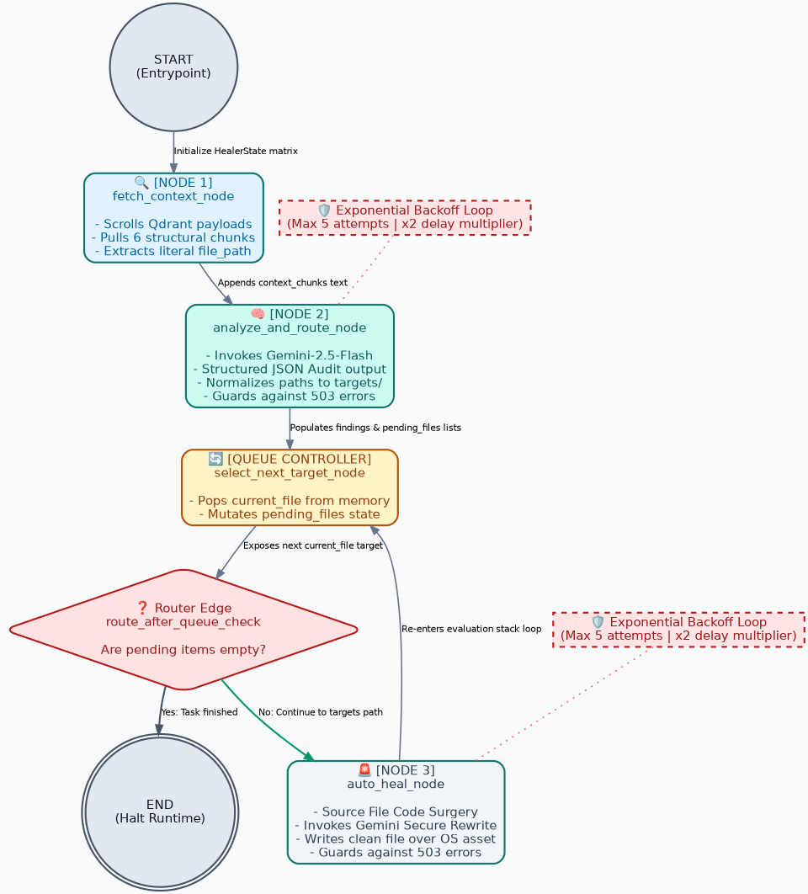
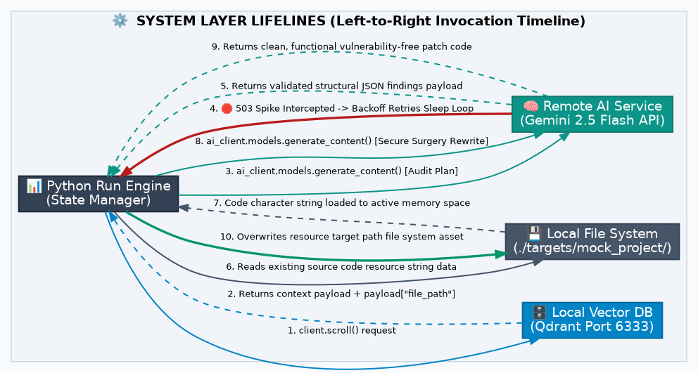
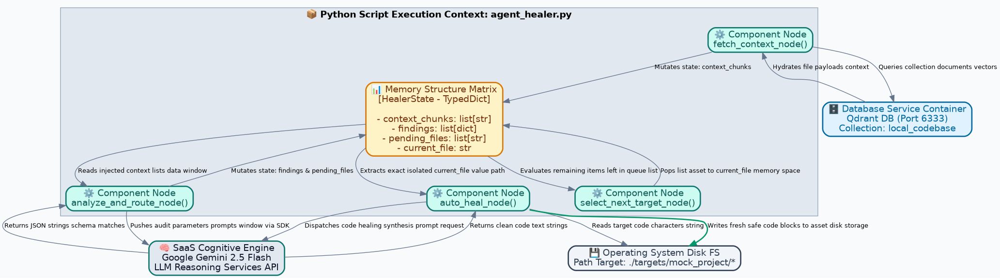
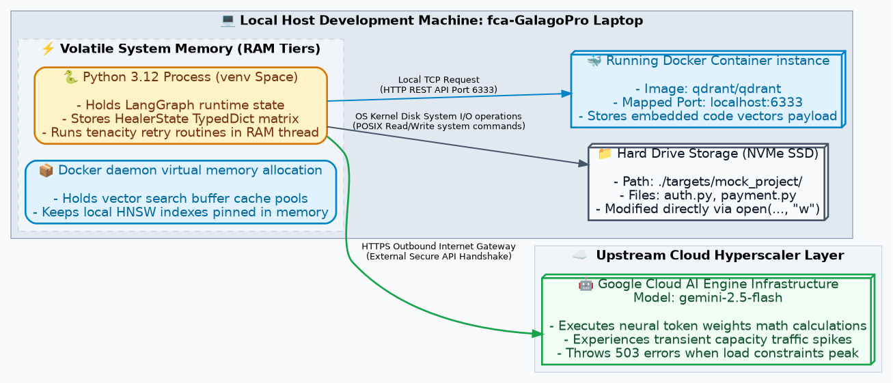

# 🛡️ Local Codebase Auditor & Self-Healing AI Agent

An autonomous security agent engineered to run strictly on localized hardware (8GB RAM optimized) to audit, categorize, and auto-heal source code vulnerabilities using LangGraph, Qdrant (Dockerized), and the Gemini 1.5 Flash API barrier.

## 🏗️ Core Architecture

This project utilizes a "Documentation-as-Code" methodology. The system architecture visualization is generated natively via Python using `matplotlib`.






### 🚨 Mandatory Synchronization Rule
To prevent architectural rot, an internal project directive is in effect: **The visualization script (`generate_blueprint.py`) must be modified in accordance with any changes or modifications made to the whole system.** Regeneration of `self_healing_architecture.png` is required if any commit changes:
1. The Agent State Structure (`HealerState`).
2. Graph Node logic or conditional edges.
3. Physical Tool definitions (file system operations).
4. Container or hardware resource boundaries.

---

## 🚦 Quick Start (8GB RAM Station Boot)

Ensure Docker is running and run the following in your virtual environment:

```bash
# 1. Wake the Station
source venv/bin/activate

# 2. Boot Docker Dependencies (Qdrant)
docker start $(docker ps -a -q --filter ancestor=qdrant/qdrant)

# 3. Perform a Self-Healing Audit Loop
python agent_healer.py
\```

---

## 🛠️ Tech Stack & Constraints
- **Host Hardware:** System76 Galago Pro (Linux Ubuntu x64)
- **RAM Constraint:** Strict 8GB Physical Pool.
- **Orchestration:** LangGraph (State Machine).
- **Vector DB:** Qdrant (via Docker), utilizing INT8 Scalar Quantization for minimal RAM footprint.
- **LLM Engine:** Gemini-1.5-Flash (Reasoning & Code Synthesis).
- **Ingestion:** gemini-embedding-001 (3072-dim vectors).
- **Validation Barrier:** Pydantic v2 (JSON Schema Enforcement).
\```